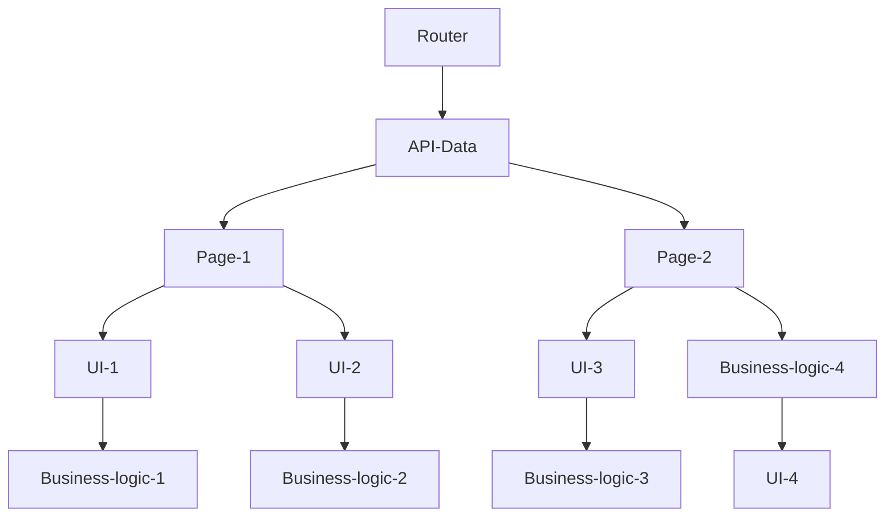

# Proposta

## Observações

Ao navegar pela [área logada do site da Serasa](https://www.serasa.com.br/area-cliente), é possível notar diversos padrões na interface, possivelmente resultado do uso de um design system, como: cards, títulos de sessões, links, e o medidor de score utilizado na página inicial e na de finanças.
Ao inspecionar a página pela devTool na aba network é possível perceber dois detalhes importantes, o uso de react com server side rendering (SSR), pois o html inicial devolvido é de uma página quase completa, e o consumo de apis rest.
Seguindo estas observações mais os pontos de atenção ressaltados na descrição do exercício 3, abaixo irei elaborar a proposta.

## Frameworks

A fim de agilizar o desenvolvimento, seguir boas praticas, reduzir o boilerplate de configurações iniciais, e manter a compatibilidade com React, eu recomendo [Remix](https://remix.run/).

Remix é um framework construído em cima do React, oque significa que os times precisariam de muito pouco treinamento, e o possível port do projeto seria simplificado.

As vantagens do Remix baseado no que li recentemente em blogs e na documentação, são principalmente: SSR o que faz com que a página carregue muito mais rápido para o usuário e também melhora o SEO; possui uma feature chamada Nested Routes, que em poucas palavras, faz o loading dos dados da página em paralelo do lado do servidor, oque resulta em um carregamento praticamente instantâneo para o usuário.

Remix é um framework fullstack o que significa que ele permite o desenvolvimento de features backend, como APIs e comunicação com banco de dados, para projetos exclusivamente Frontend para evitar monorepos, essa feature pode ser utilizada apenas como um proxy para chamadas das APIs internas do sistema, atuando como uma espécie de bff, ou simplesmente ignorada.

A principal desvantagem do Remix é ser uma framework relativamente novo e não possuir um ecossistema tão maduro quanto NextJS que oferece features similares pode ser considerado uma tecnologia consolidada no mercado, por esse motivo, deve ser levado em consideração e implementado em uma PoC ou projeto pequeno antes de fato dissemina-lo como a ferramenta padrão do sistema.

## Padrões de código

### imutabilidade

Dado a natureza funcional do React, o principal padrão a seguido é o de imutabilidade.
Imutabilidade é um dos princípios da programação funcional e ele se trata de preservar o estado de um objeto, ou seja se for necessário fazer um modificação nos dados, essa modificação deve gerar um novo objeto e preservar o anterior.

As vantagens desse padrão incluem:

- Melhor legibilidade, pois as variáveis permanecem as mesmas
- Maior segurança, como os estado é imutável você sempre terá certeza de que os dados são válidos.

### pure functions

Pure functions são funções que sempre devolvem o mesmo valor se receber os mesmos argumentos.
Para que um função seja pura, ela só pode depender de seus próprios argumentos, ou seja, ela não pode fazer uso nem alterações em partes do código fora de seu escopo.
Seu uso facilita o desenvolvimento de testes automatizados no sistema.

### Separação de responsabilidades

As responsabilidades do código devem ser divididas, isto é, deve haver separação entre código de UI, data fetching, regras de negócio entre outros.

### Atores (Em casos em que alta performance seja necessário, se houver)

Atores são uma forma de gerenciar maquinas de estado através de mensagens.
No contexto web em uma página de demande alta performance pois necessita de realizar computação complexas no lado frontend, o código responsável pela UI pode ser o único a ser executado na thread principal, todo resto como lógicas de negócio, data fetching, entre outros, podem ser executados via web workers que rodam fora da thread principal de forma verdadeiramente assíncrona. O uso de atores nesse contexto facilitaria muito a comunicação entre as camadas.
Segue uma [talk](https://youtu.be/Vg60lf92EkM) que se aprofunda um pouco mais nessa abordagem

## Arquitetura

### Geral

Visando a descentralização e liberdade tecnológica das equipes em minha opinião uma arquitetura de micro frontend, é a melhor opção.
Exitem diversas abordagens e definições para tal como apresentado por [Luca Mezzalira](https://www.youtube.com/watch?v=BuRB3djraeM) em uma de suas apresentações.

Os microfronts podem ser a nível de componente, por exemplo, uma única página pode ser composta de N diferentes repositórios controlados por diferentes equipes e tecnologias. Nesse caso é necessário a implementação de uma camada de comunicação baseada em [mensagens](https://developer.mozilla.org/en-US/docs/Web/API/Window/postMessage) e uma maior comunicação entre os time envolvidos para coordenar os contratos de comunicação.

Os microfronts também podem ser aplicações completas separadas por um escopo de time, por exemplo, um microfront para a página de inicial, outro para finanças, etc..., a princípio essa é a abordagem que recomendo, pois precisa de apenas uma aplicação "pai" para fazer os apontamentos/proxy para direcionar o usuário para a aplicação correta, e os times podem trabalhar de forma mais independente.

Para reduzir a duplicação de código uma biblioteca para componentes de Design System (DS) pode ser desenvolvida e compartilhada entre os projetos, mas apenas para DS, pois apesar de que alguns componentes fora do DS possam ser similares, eventualmente com mudanças de regras de negócio eles podem vir a ter comportamentos bem específicos para cada projeto.

### Restrições

1. As dependências (internas, não de terceiros) devem sempre apontar para baixo.
   Por exemplo dado duas páginas que necessitam das camadas de rota (Router), dados de uma api (API-Data), elementos de interface (UI), e regras de negócio (Business-logic)

No seguinte diagrama

- A página 1 segue as a restrição corretamente, pois cada camada depende uma mais interna
- Enquanto a página 2 fere a restrição, pois a camada de regras de negócio não deve se importar com como a interface é gerada.

O benefício desta restrição é facilitar o isolamento de mudanças de impacto, tornando a aplicação resiliente e menos suscetível a erros, tornando a etapa de QA mais simples.

2. Cuidado com reuso de código.
   Um código desacoplado tem mais valor que o princípio DRY. Nem todo código similar tem o mesmo propósito, pois com o tempo devido a mudanças de negócio partes do sistema podem demandar alterações específicas para um único caso de uso, e alterações em componentes/funções compartilhadas podem resultar em erros imprevisíveis em partes não intencionais do sistema.

   O benefício desta restrição é reduzir o acoplamento entre partes do sistema que não deveriam ter conhecimento uma da outra.

3. Sempre reforçar os padrões, restrições, e boas práticas de forma automática
   De nada adianta um documento perfeitamente detalhado e ilustrado com o guia definitivo dos para todos os problemas do universo se ele depois de publicado ele ficar pegando pó em algum lugar do confluence.

A melhor forma evitar isso é com o uso de testes automatizados, testes como; unitários, integração, regressão visual, e proibição de dependência, assim linters.

O benefício desta restrição é que a automatização vai garantir a preservação da arquitetura, mesmo que a documentação não seja consultada regularmente ou em troca de equipes e novos membros.

## Conclusão

Está arquitetura visa implementar os seguintes benefícios:

- Agilidade na implementação de novas futures
- Boa manutenibilidade
- Reduzir erros e agilizar o QA
- Criar aplicações performáticas, escaláveis, e resilientes
